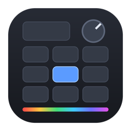
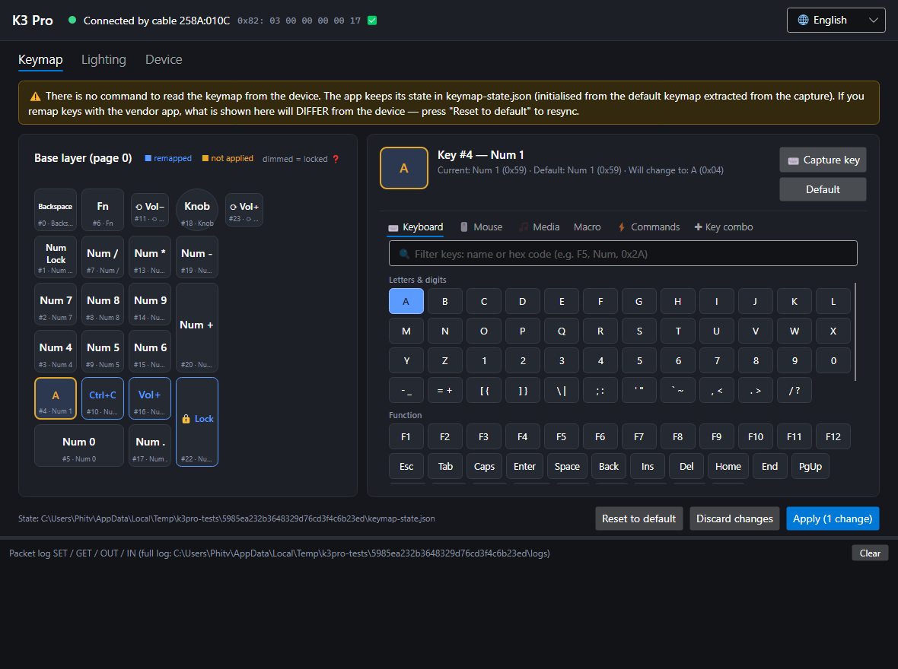
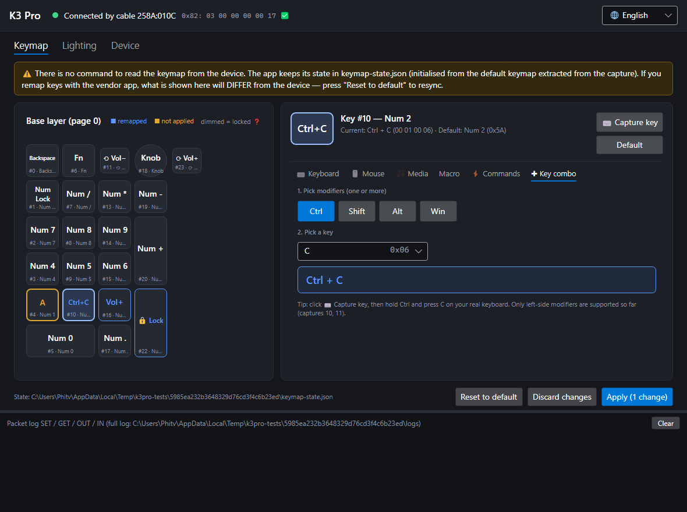
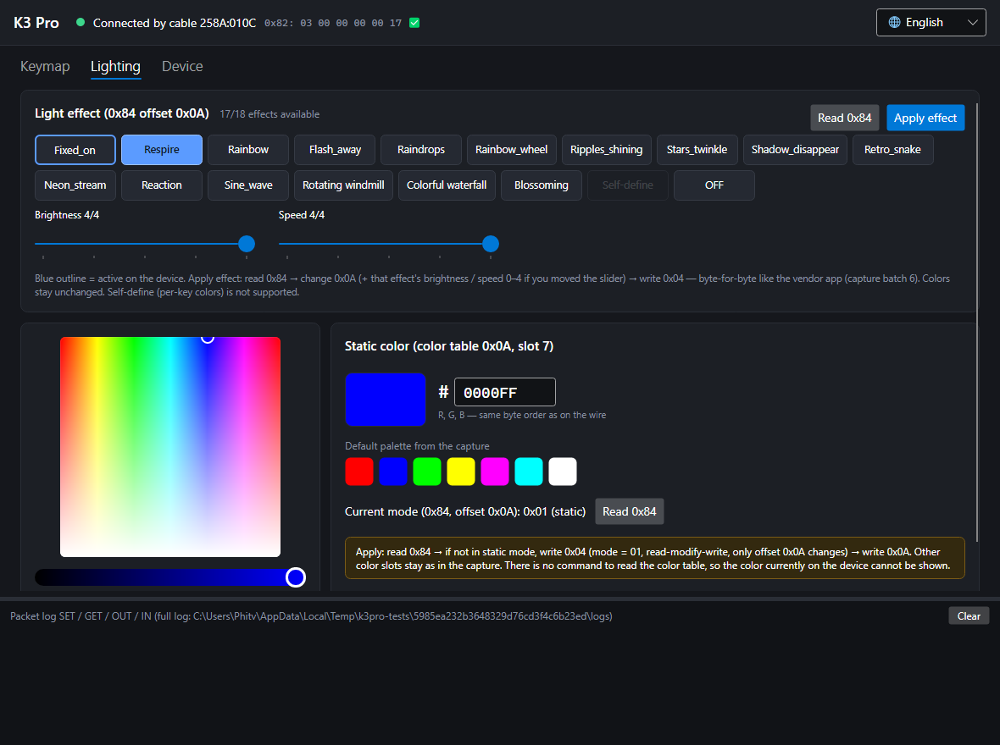
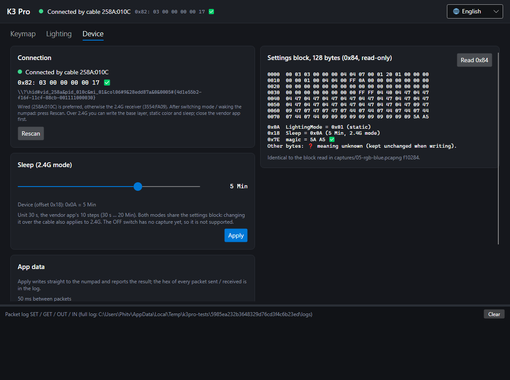

# K3Pro — Darmoshark K3 Pro Numpad Software for Windows, macOS & Linux



**Open-source configuration software and driver alternative for the Darmoshark K3 Pro numpad (keypad).**
Remap keys and the volume knob, set RGB light effects, brightness and speed, and change the **2.4G wireless sleep timer**.
It works on **Windows, macOS and Linux**, over the **USB cable** or the **2.4G receiver**. Portable, nothing to install.

[](https://github.com/tvPhi/K3Pro/releases/latest)
[](https://github.com/tvPhi/K3Pro/releases)
[](https://github.com/tvPhi/K3Pro/actions/workflows/release.yml)
[](LICENSE)


**[⬇ Download](https://github.com/tvPhi/K3Pro/releases/latest)** · [Features](#features) · [Install](#download-and-install) ·
[How to use](#using-the-app) · [FAQ](#faq) · [Protocol docs](docs/PROTOCOL.md)



> **Unofficial project.** It is not affiliated with or endorsed by Darmoshark. It writes to your numpad's configuration
> memory, so use it at your own risk. See [Safety](#safety) for exactly what it sends.

---

## Why K3Pro?

- **macOS and Linux support.** The official Darmoshark software ("Darmoshark Gaming Keyboard" / OemDrv) is Windows-only.
- **2.4G sleep timer.** Choose 30 s to 20 min. The official app hides this setting.
- **Safe by design.** Every write is built byte-for-byte like the official app's, and automated tests check this against real USB captures.
- **Lightweight and private.** A single portable executable. No installer, no background service, no account, no telemetry.
- **Open source.** MIT licensed, and the USB protocol is documented in [docs/PROTOCOL.md](docs/PROTOCOL.md).

## Contents

- [Supported hardware](#supported-hardware)
- [Features](#features)
- [Screenshots](#screenshots)
- [Download and install](#download-and-install) — [Windows](#windows) · [macOS](#macos) · [Linux](#linux)
- [Using the app](#using-the-app)
- [Things to know](#things-to-know)
- [FAQ](#faq)
- [Safety](#safety)
- [Command-line tool](#command-line-tool)
- [Building from source](#building-from-source)
- [Help unlock more features](#help-unlock-more-features)
- [License](#license)

---

## Supported hardware

| Device | Connection | USB VID:PID |
|---|---|---|
| Darmoshark **K3 Pro** numpad (shown as "K3PRO Keyboard") | USB cable | `258A:010C` |
| Darmoshark K3 Pro 2.4G receiver (USB dongle) | 2.4G wireless | `3554:FA09` |

Only the **Darmoshark K3 Pro** numpad is supported. Other Darmoshark keyboards (K6, K9 Pro, …) have different layouts
and have not been captured yet.

Inside the K3 Pro: a **BYK901** MCU (Sinowealth SH68F90A class), a separate 2.4G radio and a 1000 mAh LiPo battery.
PCB photos and details are in [docs/PROTOCOL.md → Hardware](docs/PROTOCOL.md#hardware).

**Tested so far:** Windows 11 with a real K3 Pro, over the cable and 2.4G. The macOS and Linux builds come from the same
code and are built automatically, but **nobody has tried them with the device yet**. Please
[open an issue](https://github.com/tvPhi/K3Pro/issues) with your results.

## Features

| Area | What you can do |
|---|---|
| **Key remapping** (base layer) | Remap any key to: a normal key (letters, digits, F1–F12, navigation, keypad…), a single modifier (LCtrl / LShift / LAlt / LWin), a **key combination / shortcut** (e.g. Ctrl+C, Shift+Alt+A, Win+…), **Volume +**, **Mute**, **left mouse click**, or **Lock PC** (Win+L). The Fn key and the rotary knob (turn left / turn right / press) can be remapped too. Includes a per-key "Default" and a full "Reset to default". |
| **RGB lighting** | 17 light effects: Fixed_on, Respire (breathing), Rainbow, Flash_away, Raindrops, Rainbow_wheel, Ripples_shining, Stars_twinkle, Shadow_disappear, Retro_snake, Neon_stream, Reaction, Sine_wave, Rotating windmill, Colorful waterfall, Blossoming, OFF. **Brightness and speed** (0–4) per effect. **Static color** with a color picker or hex input. |
| **Sleep timer (2.4G)** | 30 s, 1, 1.5, 2, 3, 4, 5, 10, 15 or 20 min before the wireless numpad goes to sleep. |
| **Connection** | Uses the USB cable or the 2.4G receiver automatically. Reconnects by itself when the 2.4G numpad wakes up. |
| **Battery (Bluetooth)** | In Bluetooth mode the top bar shows the **real battery level** (🔋 %), read by the OS from the standard BLE Battery Service (Windows for now). |
| **Interface** | English and Vietnamese. A packet log shows every USB packet sent and received, for the curious. |

**Not supported yet** — the official app hasn't been captured doing these, and K3Pro never guesses:

- FN1 / FN2 / Tap layers and macros
- Right-side modifiers, other media keys (Vol −, Play/Pause, …), right / middle mouse button, other system commands
- "Self-define" per-key lighting
- Changing settings over Bluetooth (use the cable or 2.4G — settings are stored in the numpad and apply to every mode)
- Battery level over the cable / 2.4G (the numpad only reports it over Bluetooth)

In the app these items appear dimmed with a 🔒 tooltip.

## Screenshots

| Key remapping | Light effects | Sleep timer and device info |
|---|---|---|
|  |  |  |

---

## Download and install

Download the latest package from [**Releases**](https://github.com/tvPhi/K3Pro/releases/latest). Every package is
self-contained and portable, so you don't need to install the .NET runtime.

| Platform | File |
|---|---|
| Windows 10 / 11 (Intel / AMD) | `K3Pro-<version>-win-x64.zip` |
| Windows 11 on ARM | `K3Pro-<version>-win-arm64.zip` |
| macOS, Apple Silicon (M1 and newer) | `K3Pro-<version>-osx-arm64.zip` |
| macOS, Intel | `K3Pro-<version>-osx-x64.zip` |
| Linux x64 | `K3Pro-<version>-linux-x64.tar.gz` |
| Linux ARM64 (e.g. Raspberry Pi 4/5 64-bit) | `K3Pro-<version>-linux-arm64.tar.gz` |

**Before you start, on every platform: quit the official Darmoshark app completely**, including from the system tray
(`OemDrv.exe` on Windows). It also talks to the 2.4G receiver, and the two apps then miss each other's responses.

### Windows

1. Extract the zip anywhere, e.g. `C:\Tools\K3Pro\`.
2. Run `K3Pro.App.exe`.
3. The app isn't code-signed, so SmartScreen may warn you. Click **More info → Run anyway**.

Keep `layout.json` next to the `.exe`.

### macOS

1. Unzip it to get `K3Pro.app`. You can move it to `/Applications`.
2. The app is ad-hoc signed but not notarized, so macOS blocks it the first time. Do one of these:
   - right-click `K3Pro.app` → **Open** → **Open**, or
   - go to **System Settings → Privacy & Security → Open Anyway**, or
   - run in Terminal: `xattr -dr com.apple.quarantine /Applications/K3Pro.app`
3. If macOS asks for **Input Monitoring** permission, allow it in System Settings → Privacy & Security.

### Linux

```bash
tar -xzf K3Pro-<version>-linux-x64.tar.gz
cd K3Pro-<version>-linux-x64

# One time: let your user access the numpad and receiver without root
sudo cp 70-k3pro.rules /etc/udev/rules.d/
sudo udevadm control --reload-rules && sudo udevadm trigger
# then unplug and replug the numpad / receiver

./K3Pro.App
```

- You need an X11 session or XWayland, plus the usual desktop libraries (`fontconfig`, `libICU`, `libX11`). Most desktop
  distributions already have them.
- Don't run the app as root. The udev rule (`TAG+="uaccess"`) gives access to the logged-in user.

---

## Using the app

### First start

- The language follows your OS: Vietnamese on a Vietnamese system, English everywhere else. You can change it any time
  with **🌐** in the top-right corner, and the choice is remembered.
- The top bar shows the connection, e.g. *Connected by cable 258A:010C* or *Connected via 2.4G*.
- **Apply writes to the numpad immediately** and shows a "Saved" or error message. There is no confirmation dialog.

### Cable vs 2.4G wireless

- If the USB cable is plugged in, the app uses it. Otherwise it uses the 2.4G receiver.
- In 2.4G mode the numpad sleeps after a while. Press any key on it and the app reconnects within a few seconds.
  If it doesn't, click **Device → Rescan**.
- Lighting, sleep time and every other setting is stored in the numpad and shared by both modes. A change made over the cable
  also applies in 2.4G.

### Keymap tab (remap keys)

1. Click a key on the numpad drawing.
2. Choose what it should do. The tabs work like the official app:
   - **Keyboard**: letters, digits, function keys, keypad and modifiers. Type in the filter box to search by name or hex code (`F5`, `0x2A`).
   - **Mouse**, **Media** and **Commands**: locked items haven't been captured yet.
   - **Key combo**: toggle Ctrl / Shift / Alt / Win and pick a key.
   - **⌨ Capture key**: press a key or a combination on your real keyboard (e.g. hold Ctrl and press C). Tap Ctrl, Shift or Alt alone to assign that modifier.
3. Pending changes are outlined in amber. Click **Apply** to write them all, or **Discard changes** to drop them.

**Default** restores the selected key. **Reset to default** writes the complete factory layout.

### Lighting tab (RGB effects)

- **Light effect**: pick an effect. The brightness and speed sliders show that effect's current values, read from the
  device. Then click **Apply effect**. A slider is only written if you moved it. Fixed_on has brightness only, and OFF has no sliders.
- **Static color**: choose a color (picker, presets or hex) and click **Apply**. This switches the numpad to Fixed_on with that color.

### Device tab (sleep timer)

- **Sleep (2.4G mode)**: choose one of the 10 steps (30 s … 20 min) and click **Apply**.
- **Settings block**: a read-only hex view of the 128-byte settings block, with the fields that are known.
- **Open data folder**: opens the folder where the app keeps its files (see below).

### Where the app stores its data

| OS | Folder | Contents |
|---|---|---|
| Windows | `%APPDATA%\K3Pro\` | `app-settings.json` (language), `keymap-state.json` (your keymap), `logs/` |
| macOS / Linux | `~/.config/K3Pro/` | same |

---

## Things to know

- **The numpad can't report its keymap**, at least not with any command the official app uses. K3Pro therefore remembers
  what it wrote, starting from the factory keymap. If you remap keys with the official app or on another computer, the drawing
  won't match the device. Click **Reset to default** once to bring both back in sync.
- **The color table can't be read either.** Applying a static color writes the default palette with your color in the static slot.
- **Brightness above 4.** Brightness changed with the knob may be stored as 7 or 9. The app shows it ("device: 7 ❓") and only
  overwrites it if you move the slider.
- **Self-define lighting.** If the numpad is in Self-define mode (set with the official app), switch to another effect once in
  the official app first.
- **The knob** changes the volume by default. Pressing it cycles its function (brightness → volume → none).
- **Going back to the official app** is fine, because everything is stored on the numpad. The official app keeps its own profile,
  though, and saving there overwrites your settings with *its* profile.

## FAQ

**Is there Darmoshark K3 Pro software for Mac?**
Yes. K3Pro runs natively on macOS (Apple Silicon and Intel). Download the `osx-arm64` or `osx-x64` package.

**Does the Darmoshark K3 Pro work on Linux?**
The numpad itself works as a normal USB / 2.4G keypad on any OS. To configure it on Linux, use the `linux-x64` or `linux-arm64`
package and install the included udev rule.

**How do I change the sleep time of the K3 Pro in 2.4G wireless mode?**
Open **Device → Sleep (2.4G mode)**, pick a value from 30 s to 20 min and click **Apply**. The cable doesn't have to be plugged in.

**How do I remap a key or the knob on the K3 Pro?**
In the **Keymap** tab, click the key or the knob area (turn left, turn right or press), pick a new function and click **Apply**.

**Can I set a shortcut like Ctrl+C on one key?**
Yes. Use the **Key combo** tab, or click **⌨ Capture key** and press the shortcut on your keyboard.

**Will it brick my numpad?**
K3Pro only sends the exact commands the official app sends, keeps unknown bytes unchanged, and never touches firmware or the
bootloader (see [Safety](#safety)). It's still unofficial software, so use it at your own risk.

**The app says "Not connected" / the 2.4G numpad isn't detected.**
Press a key to wake the numpad, quit the official Darmoshark app (it competes for the receiver) and click **Device → Rescan**.
On Linux, check that the udev rule is installed.

**Can K3Pro show the battery level?**
Yes, in **Bluetooth mode** (Windows for now): the numpad reports its real level through the standard BLE Battery Service and K3Pro
shows it in the top bar. Over the cable or 2.4G the numpad doesn't report it — the official app's hidden battery display (normally
switched off by Darmoshark) always shows 90%, even right after a full charge.

**Does K3Pro work over Bluetooth?**
The K3 Pro pairs as "K3PRO 5.0". K3Pro shows its battery level, but settings can only be changed over the cable or 2.4G for now
(no capture of configuration over Bluetooth yet). Settings are stored in the numpad, so they apply in Bluetooth mode too.

**Do I need the official driver installed?**
No. K3Pro talks to the device directly through the operating system's HID driver.

## Safety

K3Pro is deliberately conservative:

- It only sends commands that were seen in captures of the official app:
  - **Cable:** `0x82` / `0x84` (read), `0x04` / `0x03` / `0x0A` (write).
  - **Receiver:** `07` / `05` / `44` (read), `04` / `01` / `09` (write).
- Settings are always **read-modify-write**. It reads the 128-byte block, changes only the bytes it needs, checks the
  `5A A5` magic, and only then writes.
- Bytes with an unknown meaning are kept exactly as read or as captured.
- Over 2.4G, every frame must be echoed by the receiver. A missing echo gets the exact same frame resent, like the official app.
- **Never** firmware update, bootloader or factory reset.

All of this lives in `K3Pro.Protocol` (`CommandGuard`, `ReceiverGuard`, `WritePlanner`). The UI contains no protocol logic.

---

## Command-line tool

A CLI (`k3pro`) is included for scripting and debugging. **Write commands are dry-run by default**: they print the exact
packets or frames, and only send them when you add `--send`. CLI messages are in Vietnamese.

```bash
dotnet run --project src/K3Pro.Cli -- device-info
dotnet run --project src/K3Pro.Cli -- read-settings
dotnet run --project src/K3Pro.Cli -- set-sleep 20m            # dry-run: prints the frames
dotnet run --project src/K3Pro.Cli -- set-sleep 20m --send     # writes
dotnet run --project src/K3Pro.Cli -- set-mode 2 --send        # Respire
dotnet run --project src/K3Pro.Cli -- set-key 4 04 --send      # Num1 → A (index 0–23, HID code in hex)
dotnet run --project src/K3Pro.Cli -- set-static-color 00FF00 --send
```

## Building from source

Requirements: the [.NET 10 SDK](https://dotnet.microsoft.com/download).

```bash
git clone https://github.com/tvPhi/K3Pro.git
cd K3Pro
dotnet test K3Pro.slnx                 # protocol golden tests + headless UI tests
dotnet run --project src/K3Pro.App     # run the app
```

To build a portable package like the releases (swap `win-x64` for `linux-x64`, `osx-arm64`, …):

```bash
dotnet publish src/K3Pro.App -c Release -r win-x64 --self-contained true \
  -p:PublishSingleFile=true -p:IncludeNativeLibrariesForSelfExtract=true -p:EnableCompressionInSingleFile=true
```

| Path | What |
|---|---|
| `src/K3Pro.Protocol` | USB HID protocol: packets and 2.4G frames, transports (HidSharp), safety guards, models, `WritePlanner` |
| `src/K3Pro.App` | Desktop app (Avalonia 12, MVVM). `layout.json` is the physical key layout |
| `src/K3Pro.Cli` | Command-line tool |
| `tests/` | xUnit: byte-for-byte golden tests against captures, ViewModel tests, headless screenshots |
| `docs/PROTOCOL.md` | The reverse-engineered protocol (✅ confirmed / ❓ hypothesis) |
| `tools/` | Python tools that turn USB captures into test fixtures (the raw `.pcapng` captures are not published) |
| `packaging/`, `.github/workflows/` | macOS / Linux packaging and the release workflow |

**Releasing:** publish a GitHub Release tagged `vX.Y.Z` (e.g. `v0.2.0` or `v0.2.0-beta.1`). The
[release workflow](.github/workflows/release.yml) runs the tests, builds the six packages and attaches them to the release.

## Help unlock more features

Missing features stay locked until someone captures the official app doing them. You need **Windows**,
[Wireshark](https://www.wireshark.org/) with USBPcap, and the official app:

```powershell
# PowerShell as Administrator
powershell -ExecutionPolicy Bypass -File .\capture.ps1 -Batch 2 -Mode 24g
```

`capture.ps1` walks you through each step: start recording, do exactly one thing in the official app, save, stop. It also checks
that a write was recorded. Then open an issue or a pull request with the `.pcapng` files. The batches are described at
the top of the script.

Bug reports and test results on macOS and Linux are very welcome. [Open an issue](https://github.com/tvPhi/K3Pro/issues).

## License

[MIT](LICENSE) © 2026 tvPhi. Third-party components and their licenses are listed in [THIRD-PARTY-NOTICES.md](THIRD-PARTY-NOTICES.md).

"Darmoshark" and "K3 Pro" are names of their respective owner. This project is not affiliated with or endorsed by Darmoshark.
