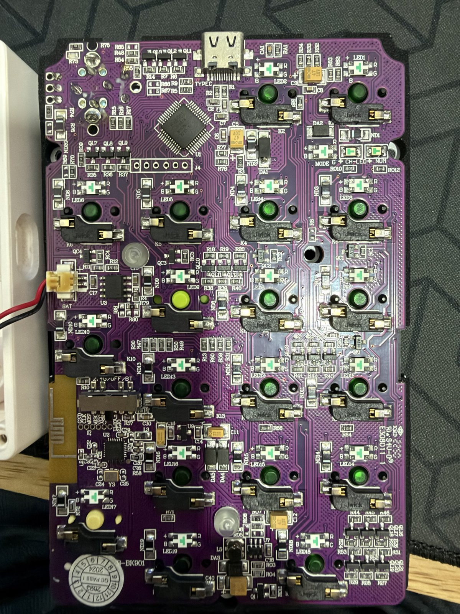
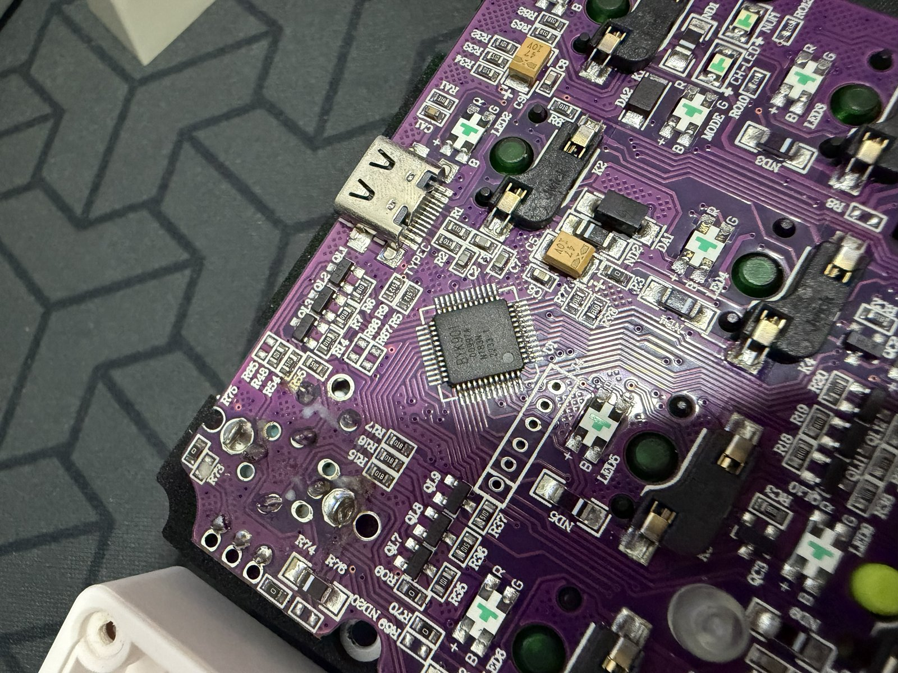
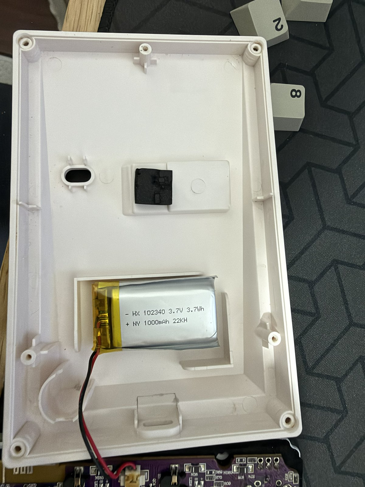

# Darmoshark K3 Pro — configuration protocol (draft)

This document describes the USB HID configuration protocol of the Darmoshark K3 Pro numpad, reverse-engineered from USBPcap captures of the vendor app, both in wired mode (`258A:010C`) and in 2.4G mode through the receiver (`3554:FA09`): transport and packet / frame layout, the commands seen so far (device info, settings block, keymap, color table), the decoded settings offsets (sleep, lighting effects, brightness / speed) and what the vendor app's own files reveal. Status markers: ✅ = confirmed (from a capture or on the real device), ❓ = hypothesis, not confirmed yet, ⚠ = caveat.

Sources: USBPcap captures of the vendor app — 01–05 (wired, the original set) and later batches 06–64 (wired + 2.4G: keymap
types, knob, sleep, battery, light effects). The raw `.pcapng` files are not published; the relevant packets are extracted into
`tests/K3Pro.Protocol.Tests/Fixtures/` (`tools/make_fixtures.py`).

## Hardware

Photos by the author (2026-10-04, unit with a 2024 QC sticker):

| Main PCB | MCU close-up | Case and battery |
|---|---|---|
|  |  |  |

- Main MCU **U1**: chip marked **BYK901** ✅, next to the USB-C port. BYK901 / BYK916 are rebranded Sinowealth SH68F90A-class
  8051 keyboard MCUs with full-speed USB — consistent with the Sinowealth VID `258A` and with the `//K916 RGB` comment in the vendor
  app's KB.ini ([GitHub topic byk901](https://github.com/topics/byk901)).
- 2.4G radio: a separate QFN chip **U2** next to the PCB trace antenna, with its own crystal **Y3** (marking not readable on the photo ❓).
  A silkscreened header near it is labelled `GND CLK MISO MOSI CS VCC` → presumably SPI between the MCU and the radio ❓.
- Mode switch silkscreen: **`2.4G/OFF/BT`** ❓. The vendor app's KB.ini has `ChannelMask=3` and no Bluetooth device has been seen,
  so the PCB is probably shared with a Bluetooth variant; Bluetooth is not covered by this document.
- 6-pin header **J4** next to the MCU (possibly the ISP / programming header ❓ — never used by this project).
- Battery: 3.7 V 1000 mAh LiPo (`HX 102340`, 3.7 Wh), 2-pin `BAT` connector; charging IC **U3** next to it ❓.
  The battery level is not reported to the host (see "Battery %" below).
- Hot-swap switch sockets (Jwick), one RGB LED per key, status LEDs `CH-LED` / `NUM` / `MODE`.
- Open-source firmware / ISP flashing tools exist for this MCU family (e.g. SMK, sinowisp). K3Pro never touches firmware or the
  bootloader (safety rule 4); this is noted for reference only.

## Transport

- All commands go through **feature report `0x06`** (520 bytes) on interface 1. ✅
- Report `0x05` is not used by the vendor app in any capture. ✅
- **Write**: `SET_REPORT 0x06` with header + data. ✅
- **Read**: `SET_REPORT 0x06` with the header (data = 0), then `GET_REPORT 0x06`. The response repeats the 8-byte header, followed by the data. ✅
  - On the wire, GET returns exactly `8 + len` bytes (14 bytes for `0x82`, 136 bytes for `0x84`) even though wLength = 520. ✅
  - Interface on Windows: `mi_01&col06`, usage `FF00:0001`, FEATURE `0x06` len 520 (including the report ID). ✅
  - 2026-10-01, real device: `0x82` → `03 00 00 00 00 17`, `0x84` → identical to the read block in capture 05. ✅
- No checksum seen in commands sent to the numpad. ✅
- The vendor app does not read back to verify after writing. ✅

## Header (8 bytes)

| Offset | Example | Meaning |
|---|---|---|
| 0 | `06` | Report ID ✅ |
| 1 | `82` / `03` / `84` / `04` / `0A` | Command code. Bit 7 = read ✅ (`0x84` reads, `0x04` writes the same block) |
| 2 | `00`–`03` | Page / index (keymap: layer number) ✅ |
| 3 | `00` | ❓ |
| 4–5 | `01 00` | ❓ always `0x0001` |
| 6–7 | `06 00`, `F8 01`, `80 00`, `8F 01` | Data length, little-endian ✅ |

## Commands seen

### `0x82` — read device info (sent by the vendor app at startup)
- Send: `06 82 01 00 01 00 06 00`
- Receive 6 bytes: `03 00 00 00 00 17` ❓ (possibly version / ID)

### `0x03` — write keymap
- Header `06 03 <page> 00 01 00 F8 01`, 504 bytes of data = 126 entries × 4 bytes. ✅
- When changing Num1 → A, the vendor app sent pages 0–3; when changing → B, it sent only page 0. ✅
- 4-byte entry: `[type] [p1] [p2] [code]` (capture batch 2 over 2.4G, 2026-10-02, entry #4 = Num1):

| Assignment in the vendor app | Entry | Notes |
|---|---|---|
| Keyboard A / B | `00 00 00 04` / `00 00 00 05` | ✅ type 00, code = HID usage |
| Keyboard > Modify > LCtrl | `00 01 00 00` | ✅ p1 = HID modifier bitmask (bit 0 LCtrl) |
| Key combination Ctrl + C | `00 01 00 06` | ✅ |
| Key combination Shift + Alt + A | `00 06 00 04` | ✅ p1 = `02` LShift │ `04` LAlt (standard HID bits) |
| Commands > lock computer | `00 08 0F 00` | ✅ Win (`08`) + L (`0F`) — the key is in **p2** (for combinations it is in code) ❓ |
| Multimedia Vol+ | `02 00 00 E9` | ✅ type 02 = consumer usage (Mute `E2` in FN1) |
| Mouse left button | `01 01 01 00` | ✅ type 01 = mouse, p1 = left button ❓ p2 = `01` |
| Keyboard FN2 | `0D 01 00 00` | ✅ FN = `0D 00 00 00`; when FN2 is assigned to a key, the vendor app puts FN2 on that key in all of pages 0, 1, 2 |
| (FN1) | `07 00 00 xx`, `08 xx 00 00` | ❓ lighting / connection functions, not in the key assignment tab |
| Macro "AB" (Cycle times 1) | `03 01 01 00` | ✅ type 03 = macro; ❓ p1 = macro number?, p2 = repeat count? |
- ❓ Not captured yet: right-hand modifiers (RCtrl…), other media keys (Vol−, Play…), consumer usage > 0xFF (Calculator `0x192`?), right / middle mouse button, scroll.

#### Macro (capture 16 over 2.4G, 2026-10-02)
- Creating a macro in the app (16a) and re-selecting the assigned macro (16b): the vendor app sends NOTHING — the macro is only stored on the PC until it is assigned + Save. ✅
- Assign + Save (16): writes keymap page 0 (`01`, #4 = `03 01 01 00`) and **a new receiver command `03`** = macro data, 2 frames (`13 03 02 00 0E …`, `13 03 02 01 0B …`), the receiver echoes. ✅
- 25 bytes of data: `04 00 15 00 04 41 00 42 00 00 00 7D 04 80 01 A6 04 00 00 8D 05 80 00 00 05` — hypothesis ❓:
  `[event count u16 = 4][remaining bytes u16 = 0x15][name length = 4]["AB" UTF-16LE][4 events × 4 bytes]`,
  event = `[bit7 = release | ? ][delay hi][delay lo][HID usage]`: A↓ (0x007D), A↑ (0x01A6), B↓ (0x008D), B↑ (0).
- ❓ Unclear: where the macro number is stored (multiple macros), repeat mode (until released / until another key is pressed / N times), the macro command in wired mode. Over the receiver, command `03` has NOT been sent by the tool yet.
- Page 0 = Default ✅, page 1 = FN1 ✅ (matches `[FN1]` in the vendor app's KB.ini), pages 2–3 = FN2 / Tap ❓ (empty in both the captures and KB.ini, order unclear).

Matrix order (page 0, default):

| Index | Code | Key | | Index | Code | Key |
|---|---|---|---|---|---|---|
| 0 | `2A` | Backspace | | 13 | `55` | Num * |
| 1 | `53` | NumLock | | 14 | `61` | Num 9 |
| 2 | `5F` | Num 7 | | 15 | `5E` | Num 6 |
| 3 | `5C` | Num 4 | | 16 | `5B` | Num 3 |
| 4 | `59` | **Num 1** | | 17 | `63` | Num . |
| 5 | `62` | Num 0 | | 18 | type `07` code `11` | Knob press — "切模式": cycles the knob function (brightness → volume → none) ✅ |
| 6 | type `0D` | Fn ❓ | | 19 | `56` | Num − |
| 7 | `54` | Num / | | 20 | `57` | Num + |
| 8 | `60` | Num 8 | | 22 | `58` | Num Enter |
| 9 | `5D` | Num 5 | | | | |
| 10 | `5A` | Num 2 | | 11 / 23 | empty | Knob rotate left / right (KB.ini 左旋 / 右旋) ✅ index |
| | | | | 12 / 21 | empty | No key |

Page 1 (FN1 ✅) has non-zero values at index 0, 2, 5, 7, 8, 13, 14, 18, 19, 20 — exactly the 10 `[FN1]` entries in KB.ini.

#### Knob and Fn key (captures 17 – 17f, 2026-10-02) ✅
| Capture | Vendor app writes (page 0) |
|---|---|
| 17 rotate left → A | `#11 = 00 00 00 04` |
| 17b rotate right → B | `#23 = 00 00 00 05` |
| 17c knob press → C | `#18 = 00 00 00 06` |
| 17d reset knob to default | `#11 = #23 = 00 00 00 00`, `#18 = 07 00 00 11` → the whole page equals the baseline; rotating the knob adjusts volume again, left = down ✅ (confirmed by the author) |
| 17e Fn → D | `#6 = 00 00 00 07` (pages 1, 2 written along with it, unchanged) |
| 17f Fn back to default | `#6 = 0D 00 00 00` in page 0, **1 and 2** (previously pages 1–2 had `#6 = 00 00 00 00`) |
- The special entries accept a type 00 HID usage like normal keys; "default" = rewriting the baseline entry → the tool unlocks #6 / #11 / #18 / #23 (page 0) with exactly those restore values.
- The vendor app writes page 0 from its own profile (in capture 17 Num1 was still B) → after 17d / 17f the device's page 0 = baseline.
- ❓ After 17f the device has page 1 / 2 `#6 = 0D 00 00 00` (different from the page 1 baseline of capture 02); the tool only writes page 0, so this has no effect.

### `0x84` / `0x04` — read / write settings block (128 bytes)
- The vendor app reads first (`0x84`), modifies, then writes back (`0x04`): read-modify-write. ✅
- The block ends with the magic `5A A5`. ✅
- **Offset `0x18` = Sleep (2.4G mode), unit 30 s** ✅ (captures 31–34): `01` = 30 s, `0A` = 5 Min (original value in captures 04/05), `28` = 20 Min. The vendor app offers 30 s … 20 Min (`01`…`28`).
- Offset `0x0A` = lighting mode: `03` → `01` when static is selected ✅ (`01` = static; `03` = the previous mode, name unknown)
- Offset `0x3A`–`0x73`: repeating byte pairs `04 47`, `09 47`, `07 44`… — see the knob experiment below.

#### Knob experiment on the real device (2026-10-02, `0x84` reads only; history in the local `captures/settings-snaps.json`, tool `tools/settings_snap.py`)
- **The device modifies the settings block by itself** (not through the app): read-modify-write immediately before writing `0x04` is mandatory — `K3ProDevice.Execute` already re-reads 0x84 before sending. ✅
- The device was in mode `0x0A = 03`. Press the knob → rotating adjusts LED brightness: **byte `0x3E` = `09` (brightest) … `00` (darkest)**, ~1 unit / step (4 steps → `04`). ✅ observed.
  - ❓ Hypothesis: each mode `m` has a pair `[brightness][?]` at `0x38 + 2·m` (mode 3 → `0x3E`/`0x3F`; mode 1 static → `0x3A`/`0x3B` = `04 40`). The second byte (`40` / `47` / `44`) may be speed / flags. Device brightness is 0–9, while KB.ini has `Light=0..4` → the vendor app's scale is unclear.
  - ❓ `0x1A`: `00` (capture) → `01` → `02` while adjusting brightness with the knob; meaning unknown.
- **Knob press = cycles through 3 functions: adjust brightness → adjust volume → do nothing** ✅ (observed by the author). Pressing the knob does not change the block → this state lives only in RAM ❓.
- `set-mode 1 --send` after the experiment: the block sent kept `0x3E = 09`, `0x1A = 02` as set by the knob; read-back matches ✅ (RMW does not overwrite changes made on the device).
- During testing, `0x0A` changed `01 → 03` on the device itself (no write command from the tool) — unknown which action caused it ❓.

### `0x0A` — write color table (399 bytes)
- Header `06 0A 00 00 01 00 8F 01`. 399 bytes = 133 RGB colors = **19 modes × 7 colors** ❓
- Byte order **R, G, B** ✅
- Colors 0–6 (mode 0) are all `000000`; color 7 = the currently selected static color ✅ (red `FF0000` → blue `0000FF`, only these bytes change)
- The remaining slots are the default palette, repeated: red, blue, green, yellow, purple, cyan, white.

## Hints from the vendor app UI (Key assignment screenshot, 2026-10-02) — all ❓ until captured
- **Physical layout**: the top row has 2 custom keys (picture keycaps) + 1 rotary knob; below it is a standard 17-key numpad.
  The matrix order matches a 4 columns × 6 rows layout, `index = column × 6 + row`:
  - Row 0: index 0 = left custom key (default Backspace), 6 = right custom key (FN, type `0D`), 18 = knob press. ✅ (KB.ini)
  - Knob rotation: 11 = left, 23 = right ✅ (KB.ini). Empty entry (`00 00 00 00`) → firmware default is volume control ✅ (observed on the real device, 2026-10-02). Writing the keymap from the baseline keeps these 2 entries unchanged, so the volume function is not lost.
  - Rows 1–5: NumLock / * −, 7 8 9 +(2u), 4 5 6, 1 2 3 Enter(2u), 0(2u) . ✅ (KB.ini)
- **4 layers**: Default / FN1 / FN2 / Tap (`LayerNum=4`). Default = page 0 ✅, FN1 = page 1 ✅, FN2 / Tap = page 2 / 3 ❓.
- **Assignment types** (lower tabs): Keyboard, Mouse, Multimedia, Macro, Commands, Key combination → candidates for the `type` byte:
  - Keyboard → type `00` ✅ (A/B confirmed). This tab also has the Modify group (LCtrl… RWin) and FN / FN2 → encoding unknown.
  - Multimedia → type `02` + consumer usage (Mute = `E2` matches the HID Consumer page) ❓. List: Play/Pause, Mute, Stop, Prev, Next, Vol+, Vol−, Home, Calculator, Mail, My Computer, Favorites, Brightness+, Brightness−.
  - Mouse (5 buttons: left, right, middle, 2 buttons with up / down arrows), Macro (repeat until released / until another key is pressed / N times), Commands (13 system commands), Key combination (Ctrl / Win / Alt / Shift + key → possibly a modifier bitmask in `p1`).
  - Type `07` / `08` (page 1: `07 00 00 04..0A`, `08 00/02/04 00 00`) may be lighting / connection functions — not in the key assignment tab.
- **Profile**: the vendor app stores profiles on the PC (import / export) and capture 01 only reads `0x82` → most likely the vendor app does not read the keymap from the device either.

## Vendor app configuration: `C:\Program Files (x86)\Darmoshark Gaming Keyboard\Dev\kb\K3PRO\KB.ini`
The file is only read, never copied into the repo. What matches the captures:
- `VID=0x258a PID=0x010c`, `VID_Wireless=0x3554 PID_Wireless=0xfa09` ✅.
- `Psd=3,0,0,0,0,17` = exactly the `0x82` response (`03 00 00 00 00 17`, reading `17` as hex) ✅ → the vendor app uses `0x82` to identify the device. `Fw=24` ❓.
- `LayerNum=4`; sections `[KEY]` (Default), `[FN1]`, `[FN2]`, `[Tap]`.
- Key lines: `Kn = x1,y1,x2,y2, <kind>, <value>, <extra>, <matrix index>` (coordinates on `keyimg.png`).
  - Kind `0x02` + Windows virtual-key (Backspace `0x08`, NumLock `0x90`, Num1 `0x61`…; FN = `0xFA` and Num Enter = `0xFD` are the app's own codes) — the app converts them to HID usages itself when writing.
  - Kind `0x09` + flag + raw 32-bit big-endian entry `[type][p1][p2][code]`: e.g. `0x09,0x01,0x07000011` = entry `07 00 00 11` ✅ (index 18 page 0). `0x09,0x00,0` = unassigned (knob rotation).
  - `[FN1]`: the 10 kind-`0x09` entries match page 1 in capture 02 byte for byte ✅.
- Lighting: `Light=0..4`, `Speed=0..4` (5 levels ❓ offset unknown), `DefLedIndex=10`.
  `LedOpt<n> = hw, effect, speed, light, direction, random, color` (per-effect capability flags). `hw=1` → effect 1 = "Fixed_on" (text.xml) = static ✅ matches offset `0x0A = 01`.
  `hw=3` → effect 2 = "Respire" ❓ (mode 03 in capture 04). Effects > 22 (28, 29, 30) have no name in text.xml → the effect name table is uncertain.
- `Text/en/text.xml`: effect names (`tc_kb_led1..20`: Fixed_on, Respire, Rainbow, …, Self-define, OFF), multimedia, mouse, 13 Commands, macro.

## 2.4G receiver (`3554:FA09`)
- In 2.4G mode the numpad does not show up as `258A:010C` (checked on the PC, 2026-10-02); only the receiver remains. The receiver has no 520-byte feature report `0x06`. ✅
- **20-byte frame** (SET_REPORT output `0x13` → receiver; response via interrupt IN ep2 `0x13`) ✅ captures 33/34:
  `[0]=13 [1]=cmd [2]=frame count [3]=frame index [4]=payload length [5..18]=14-byte payload [19]=checksum`
  - Checksum = 8-bit sum of bytes 0–18 — matches 80/80 frames ✅. The unused payload in the last frame is buffer garbage (still counted in the checksum).
  - Commands = the wired commands, wrapped:

| Sent (OUT) | Response (IN) | Wired equivalent |
|---|---|---|
| `13 07 01 00 00 … 1B` | `13 07 01 00 01 01 … 1D` (2.4G) / `… 01 00 … 1C` (when wired) | — status ❓ (byte 5 = numpad currently on 2.4G?) |
| `13 05 01 00 00 … 19` | `13 05 01 00 0A 03 00 00 00 00 17 00 00 10 00 … 4D` | `0x82` (first 6 bytes identical) + `00 00 10 00` ❓ |
| `13 44 01 00 00 … 58` | 10 frames `13 44 0A <i> <len> <14 byte>`: 9 × 14 + 2 (`5A A5`) = 128 bytes | `0x84` read settings |
| 10 frames `13 04 0A <i> 0E <14 byte>`, last frame len `02` | the receiver echoes every frame back unchanged | `0x04` write settings |
| 36 frames `13 01 24 <i> P E <14 byte>` | echoes every frame | `0x03` keymap page P (504 bytes): byte 4 = `0E` page 0, `1E` page 1, `2E` page 2 — captures 22/23, 14/15 ✅ |
| 29 frames `13 09 1D <i> 0E <14 byte>`, last frame len `07` | echoes every frame | `0x0A` color table (399 bytes) — captures 24/25 ✅ |

- **The settings block is shared by both modes** ✅: capture 32 (wired) writes `0x18 = 28` → capture 33 (2.4G) reads back `28`.
  The only visible difference: data `0x0E` = `01` when read over 2.4G, `00` when read over the wire ❓ (possibly the current connection mode).
- The vendor app in 2.4G also does read-modify-write (read `44` → write `04`), with packets ~23 ms apart.
- Data reassembled from frames `01` / `09` matches the wired `0x03` page 0 / `0x0A` packets for the same action byte for byte (captures 02↔22, 03↔23, 04↔24, 05↔25) ✅.
- **Byte 4 = `(page << 4) | length`** ✅ (keymap page 1 / 2 = `1E` / `2E` in captures 14 / 15; settings and colors are always page 0). Page 3 (Tap) not seen yet.
- Captures 06 / 07 / 08 (Num1 in FN1 / FN2 / Tap) over 2.4G: the vendor app sent NO write frames (only 07 / 05) ❓ — possibly Save did not get through in time; needs to be recaptured. (Capture 16 (macro) was recaptured successfully, see the Macro section.)
- ⚠ Capture 17d (reset knob to default over 2.4G): frame `01` #16 was sent 4 times with no echo (earlier echoes were 200–300 ms late) → the vendor app gave up. The page 0 state afterwards is uncertain.
- The old wired captures 17 / 17b / 17c / 17d were overwritten by 2.4G versions (batch 2 was run without `-Mode 24g`); the 2.4G versions give exactly the same entries #11 / #23 / #18 as the wired ones.
- A normal echo arrives after ~8 ms. No echo → the vendor app waits ~1 s, then **resends that exact frame** (capture 22 frame #3, 24 #6, 25 #26) ✅.
  A `44` read with missing frames → the vendor app re-requests `44` (capture 24: 9 frames, then the re-request returned all 10) ✅.
- Selecting a static color in 2.4G: the vendor app writes `04` (mode 01) then `09` — even when the mode is already 01 (captures 24/25).
- 2026-10-02 15:00, **the author performed a real write over 2.4G with K3Pro.App**: static color `00FF00` → all 29 `09` frames echoed, the LEDs changed color ✅ (log `%APPDATA%\K3Pro\logs\k3pro-20261002.log`).
- Interface 1 of the receiver has only the IN endpoint `0x82` (descriptor in the capture) → output reports go via control SET_REPORT; `HidStream.Write` produces exactly the same packet as the vendor app. ✅
- 2026-10-02, real device over 2.4G (this project's tool, read-only): `07` → `… 01 01 … 1D`, `05` → `03 00 00 00 00 17 00 00 10 00`, `44` → 128-byte block, magic ✅, `0x18 = 28`, `0x0E = 01`. ✅
- Golden test: the 10 sleep-write frames built by the tool match the vendor app byte for byte (capture 33: `01`, capture 34: `28`). ✅
- 2026-10-02, **real write over 2.4G with the tool**: `set-sleep 10m` → all 10 `04` frames echoed, reading `44` back gives `0x18 = 14` ✅; a later read still gives `14` (persisted).
  Afterwards (with the vendor app closed) `set-sleep 20m` → 10 frames byte-identical to capture 34, echo + read-back match ✅.
- ⚠ While the vendor app (`OemDrv.exe`) is running (even in the tray), one `44` read by the tool got no response → the tool stopped before sending any write frame. Close the vendor app when using the tool over 2.4G.
- The vendor app's Sleep slider has 10 steps (read from the UI by the author): 30 s, 1, 1.5, 2, 3, 4, 5, 10, 15, 20 Min = `01 02 03 04 06 08 0A 14 1E 28`.
- Vendor interface of the receiver: `mi_01&col01`, usage `FF02:0002`, in/out 20 bytes. ✅
- At startup (even while the numpad is wired), the vendor app sends SET_REPORT output `0x13`: `13 07 01 00 00 … 00 1B`;
  the receiver answers on interrupt IN ep2: `13 07 01 00 01 00 … 00 1C` (capture 01). ✅
- Last byte = 8-bit sum of the preceding bytes (`13+07+01 = 1B`, `13+07+01+01 = 1C`) — matches 2/2 samples ❓.
- `07 01` = status query, answered by the receiver itself (the numpad does not need to be awake): **response byte 5 = `01` when the numpad is connected via 2.4G, `00` when the numpad is asleep / off / wired** ✅ (K3Pro.App polls with this command every 3 s and reconnects automatically when the numpad wakes up — confirmed by the author 2026-10-02). Command `05` requires the numpad to be awake (asleep → no response).
- Configuration over the receiver ✅ (captures 21–25, 33/34, batch 6): see the frame table above — `44` read settings, `04` write settings,
  `01` keymap pages 0–2, `09` color table; each write frame is echoed by the receiver.

## Sleep (hidden in the vendor app)
- `OemDrv.exe` reads the INI keys `ShowPower` and `SleepTime` from `KB.ini`; K3PRO, K6, K9PRO all have `ShowPower=0` and no `SleepTime` → the Sleep UI is hidden. ✅ (strings in the exe)
- text.xml already contains the text for this feature: "In wireless mode, keyboard will go into sleep after idle for a specified time", units Second / Min. ✅
- ~~Unknown where sleep is stored~~ → solved by captures 31–34 (`capture.ps1 -Batch 4`, after enabling the hidden UI): offset `0x18` of the settings block, see below.
- Static analysis of `OemDrv.exe` (x86, 0x4102D6): `SleepTime` is read with the same integer INI function as `ShowPower` / `LayerNum`, **default `0x78` = 120** ❓ (unit unknown). `ShowPower=1` → the app shows battery % (Device Info: Firmware V0.0.6, Battery 90% — not in the `0x82` response; capture 35 shows no dedicated read command either, see "Battery %" below ❓).
  UI: Global > Sleep = ON/OFF switch + slider **30 s … 20 Min** (currently 5 Min) ✅ screenshot.
- **Decoded** (see settings block `0x18` and the 2.4G receiver section): writing over the wire or via the receiver both work, same byte.
  ❓ The OFF switch (possibly `0x18 = 00`) and values > 20 Min are not captured yet → currently blocked.
- Vendor app quirk: its first write in capture 31 also changed `0x38` `01 → FF` (parameter pair of mode 0) — this project's tool keeps `0x38` unchanged, as read.
- Light effect ✅ (capture batch 6, 2.4G, 2026-10-02 — vendor app kept open throughout, one effect selected per step):
  - The vendor app writes `04` settings (10 frames) — **only offset `0x0A` changes** — then `09` color table (29 frames), but the color table content is identical to the previous one
    → the tool only writes `04`. Golden test: previous step's block + changed mode = every frame the vendor app sent (`Light_effect_over_2_4G_matches_vendor_app_byte_for_byte`).

    | Effect | 0x0A | Effect | 0x0A | Effect | 0x0A |
    |---|---|---|---|---|---|
    | OFF | `00` | Ripples_shining | `07` | Sine_wave | `0D` |
    | Fixed_on | `01` | Stars_twinkle | `08` | Rotating windmill | `0F` |
    | Respire | `02` | Shadow_disappear | `09` | Colorful waterfall | `10` |
    | Rainbow | `03` | Retro_snake | `0A` | Blossoming | `11` |
    | Flash_away | `04` | Neon_stream | `0B` | Self-define | `15` ⚠ |
    | Raindrops | `05` | Reaction | `0C` | | |
  - `0E` / `12` exist in KB.ini (`LedOpt14` / `LedOpt18`), but `LedMask=0x22000` (bits 13, 17) hides them from the UI → not used.
    `LedOptN = hw, effect, speed, light, direct, random, color`: hw = the `0x0A` value ✅ (matches 18/18, `LedOpt19 = 21` = Self-define `0x15`, `LedOpt20 = 0` = OFF).
  - Per-mode parameters: `[0x38 + 2·mode]` = brightness, high nibble of `[0x39 + 2·mode]` = speed, low nibble ❓ keep unchanged.
    Captures 61/62: Respire `0x3C` `04→00` (MIN) / `00→04` (MAX); 63/64: `0x3D` `47→07` (MIN) / `07→47` (MAX). Capture 42: the vendor app also writes `0x4E` (brightness of mode `0B`)
    `07→04` = syncing its own profile. Levels 0..4 per KB.ini `LightHW` / `SpeedHW = 0,1,2,3,4` (captures confirm 0 and 4; 1–3 from KB.ini).
    The device may have brightness > 4 (`07`, `09` — from the knob?) ❓: the tool only displays it, and only writes 0..4 when the user drags the slider.
  - Self-define (capture 57): `0x0A = 15` + `0x09 = 01` ❓ + receiver command **`02`** (28 frames, per-key colors) — not enabled yet. When leaving Self-define (58 → OFF), the vendor app clears `0x09 = 00`;
    the tool refuses to change the effect when `0x09 ≠ 0` (leaving Self-define for another effect is not captured yet).
- Battery % — **not available** (conclusion 2026-10-04, details below): the vendor app always shows **90%**, even right after a full charge,
  and nothing it reads from the device ever changes → its battery display (hidden by default, `ShowPower=0` for K3PRO) shows a fixed
  value, not a measurement. The numpad doesn't report a battery level over USB / 2.4G that we have seen, so K3Pro shows none.
- Battery % investigation (2026-10-02): searched every capture 01–34 (read-only) — the receiver only has commands `01 03 04 05 07 09 44`, interrupt IN only carries `0x13` frames;
  no frame contains `5A` (90%) except the settings magic. The `05` response (`03 00 00 00 00 17 00 00 10 00`) is identical in every capture → no battery byte seen yet.
  The vendor app may only read the battery when Device Info is opened. Need capture `capture.ps1 -Batch 5` (35–37, noting the % shown by the vendor app) before building a battery UI.
  - Capture 35 (2.4G, vendor app opened Device Info, showing **90%**): the receiver only has `07` → `05` (resent once) → `07`; NO dedicated battery command.
    `05` response = `03 00 00 00 00 17 00 00 10 00` — identical in every capture from morning to evening (the vendor app has also shown 90% since the morning).
    → the battery level (if present) can only be in the last 4 bytes `00 00 10 00` ❓ (e.g. `10` = raw battery level?), or the vendor app shows a fixed number ❓.
    KB.ini K3PRO: `Fw=24`, `Psd=3,0,0,0,0,17` (= first 6 bytes of `0x82` / `05`). A capture at a different % was planned (36), but the vendor app shows 90% at every charge level (confirmed by the author 2026-10-04) → not needed.
  - Wired: the vendor app does NOT show Battery (confirmed by the author 2026-10-02) → battery % is only available in 2.4G, via the receiver.
- Vendor app data in `%LOCALAPPDATA%\BYCOMBO4\` (read-only, 2026-10-02) — NO battery info:
  `K3PRO Keyboard\profile.dct` (14228 bytes) = vendor app profile: keymap as `02 <VK Windows>` (`90` NumLock, `6F` Num/, `FA` FN, `FD` Num Enter…),
  FN1 layer as `01 00 00 09 <code> 00 00 <type>`, Num1 = `05 A3 29 25 00` (references macro id `0x2529A3`), color table of 7 colors × many modes starting at 0x33DC;
  `mac.dct` = 2 macros ("A B macro", "A,B macro": keys 0x41 / 0x42 + delay); `gSetting.dct` (76 bytes) contains `00 FF 00` (the current static color) ❓.
- 2026-10-02: the author changed `Dev\kb\K3PRO\KB.ini` line 19 `ShowPower=0` → `ShowPower=1` (no backup file; to restore, change it back to `0`).

## Still to capture (see `capture.ps1`)
1. ~~Each lighting mode in turn → map offset `0x0A` values to `LedOpt` (`hw`)~~ ✅ batch 6 (41–58)
2. ~~Brightness / speed min and max~~ ✅ captures 61–64. Still ❓: levels 1–3 (taken from KB.ini `LightHW` / `SpeedHW`) and the 0–4 (app) ↔ 0–9 (knob) brightness scale
3. ~~Remap a key on the Fn layer → confirm page 1~~ (confirmed via KB.ini); FN2 / Tap ↔ page 2 / 3 still open (captures 06–08 have no write — redo with `-Mode 24g`)
4. ~~Media key / combination with Ctrl, Shift → decode type and `p1`, `p2`~~ ✅ captures 09–15. Still open: other media keys (Vol −, Play/Pause…), right / middle mouse button, right-side modifiers
5. Macro: partially decoded (captures 16, 16a, 16b — receiver command `03`), not enabled
6. ~~Battery %~~ — not available: the vendor app always shows a fixed 90% (see "Battery %" above)
7. Self-define per-key colors: receiver command `02` (capture 57), not decoded
